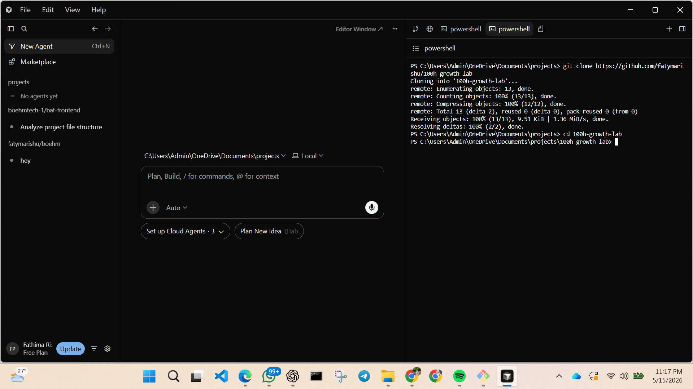
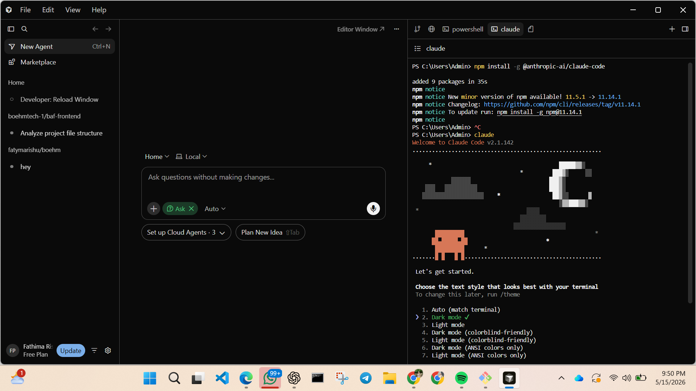

# 100h-growth-lab

## AI Workflow & Growth Marketing Portfolio Task

This repository documents the setup process, workflow organization, and learnings from completing the initial portfolio assignment for the Junior Growth Marketing Specialist role at 100Hires.

The objective of the task was not simply installing tools, but demonstrating independent problem-solving, workflow organization, adaptability, and thoughtful use of AI-assisted environments.

The repository captures the setup process, tooling decisions, workflow structure, troubleshooting steps, and reflections from the overall experience.

---

# Project Overview

This project involved:

- Setting up an AI-assisted working environment
- Configuring modern AI productivity workflows
- Creating and organizing a GitHub repository
- Documenting setup processes clearly and concisely
- Navigating tooling issues independently
- Maintaining a clean and structured workflow throughout the process

The overall focus was execution quality, clarity, adaptability, and practical use of AI tools with human judgment and verification.

---

# Tools & Environment

| Tool | Purpose |
|------|----------|
| Cursor IDE | Primary AI-assisted development environment |
| Claude Code CLI | AI-assisted workflow support and terminal-based interaction |
| OpenAI Codex CLI | AI-powered coding workflow assistance |
| Git | Version control and change tracking |
| GitHub | Repository hosting and documentation |

---

# Workflow / Setup Process

## 1. Environment Setup

- Installed Git locally
- Configured GitHub access
- Installed Cursor IDE
- Prepared local project workspace

---

## 2. AI Workflow Configuration

- Installed and tested Claude Code CLI
- Configured OpenAI Codex CLI inside Cursor terminal workflow
- Verified operational AI-assisted environment
- Tested login, accessibility, and command execution

---

## 3. Repository Initialization

- Created public GitHub repository
- Structured project directories
- Added documentation and assets organization

---

## 4. Documentation Workflow

- Structured README for readability and clarity
- Organized workflow sections intentionally
- Documented setup decisions and troubleshooting steps
- Maintained concise and scan-friendly formatting

---

## 5. Version Control Workflow

- Tracked project changes using Git
- Used structured commit messages
- Pushed workflow updates incrementally to GitHub

---

# Challenges & Resolutions

## Challenge: AI Extension Availability Inside Cursor

Some AI extensions referenced during setup were not consistently visible through the Cursor marketplace environment.

### Resolution

Researched alternative setup approaches and continued the workflow using stable CLI-based integrations inside Cursor.

This reinforced the importance of adaptability and workflow continuity when working with rapidly evolving AI tooling ecosystems.

---

## Challenge: Balancing Simplicity With Clear Documentation

A major consideration during the README creation process was keeping the repository professional and structured without making it overly technical or overdesigned.

### Resolution

Focused on concise writing, clear formatting, readable hierarchy, and practical documentation rather than unnecessary complexity.

---

# Key Learnings

- AI tools improve workflow speed, but effective execution still depends on human judgment and verification.
- Independent troubleshooting is an important part of working with modern AI tooling environments.
- Clear documentation improves organization, readability, and workflow continuity.
- Simplicity and clarity are often more effective than overengineering.
- Adaptability matters when working with fast-changing AI ecosystems.

---

# Reflection

This task highlighted how modern AI-assisted workflows are less about automation alone and more about maintaining clarity, adaptability, and good judgment throughout execution.

One of the most valuable parts of the process was navigating tooling inconsistencies while continuing progress without overcomplicating the workflow.

The experience reinforced the importance of structured thinking, practical problem-solving, and intentional documentation when working in fast-moving startup environments.

---

# Screenshots

## Cursor Workspace

## Claude Code CLI Setup

---

## OpenAI Codex CLI

---

## GitHub Repository

---

# Workflow Notes

Additional improvements included:

- Organizing screenshots inside a dedicated `/assets` directory
- Maintaining consistent markdown formatting
- Using workflow-focused documentation instead of excessive customization
- Keeping the repository clean, readable, and easy to navigate

The goal was to create a repository that feels intentional, practical, and professionally organized without overdesigning the presentation.

---

# Final Notes

This repository represents a small but intentional workflow exercise focused on execution quality, independent learning, adaptability, and thoughtful use of AI-assisted tools.

The process emphasized clarity, structured workflows, and maintaining progress through practical problem-solving and organized execution.
